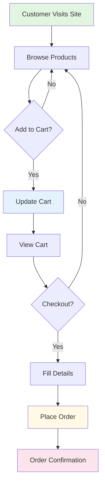

<div align="center">

# NxtGen E-Commerce Platform

### Modern E-Commerce Solution with Dynamic Product Management

<p align="center">
  
</p>

[](https://nextgenelectra.netlify.app/)
[](https://nextgenelectra.netlify.app/)
[](LICENSE)

</div>

---

## 📋 Overview

NxtGen is a **modern e-commerce demonstration platform** built with contemporary web technologies. It showcases a fully functional online store with dynamic product catalog, shopping cart functionality, and integrated checkout process.

<table>
  <tr>
    <td align="center">🛒<br><b>Dynamic Cart</b><br>Real-time cart updates with localStorage</td>
    <td align="center">📱<br><b>Responsive Design</b><br>Optimized for all devices</td>
    <td align="center">⚡<br><b>Fast Performance</b><br>Built with vanilla JavaScript</td>
    <td align="center">🔧<br><b>Admin Dashboard</b><br>Product management system</td>
  </tr>
</table>

---

## ✨ Features

<details open>
<summary><b>🛍️ Core E-Commerce Features</b></summary>

- 📦 **Dynamic Product Catalog** - Products load dynamically with filtering
- 🛒 **Shopping Cart System** - Full cart functionality with localStorage persistence
- 💳 **Checkout Process** - Integrated with Web3Forms for order processing
- 🔍 **Product Search** - Search and filter products by category
- 📊 **Admin Dashboard** - Manage products, inventory, and orders
- 💾 **Data Persistence** - Cart items saved in browser localStorage

</details>

<details open>
<summary><b>🎨 User Experience</b></summary>

- 📱 Fully responsive design for mobile, tablet, and desktop
- ⚡ Fast loading and smooth transitions
- 🎯 Clean, modern interface
- 🧭 Intuitive navigation and user flow
- ✨ Real-time cart updates

</details>

<details open>
<summary><b>🔐 Technical Features</b></summary>

- 🌐 Modern HTML5 semantic markup
- 🎨 Tailwind CSS for responsive styling
- 🚀 Vanilla JavaScript (no heavy frameworks)
- 📮 Web3Forms integration for contact/checkout
- 🔄 RESTful architecture
- 💻 Easy to deploy and maintain

</details>

---

## 🚀 Live Demo

<div align="center">

**🌐 Visit the live site:** [nextgenelectra.netlify.app](https://nextgenelectra.netlify.app/)

[](https://nextgenelectra.netlify.app/)

</div>

---

## 📁 Project Structure

```
nextgenelectra/
├── index.html              # Home page with product catalog
├── cart.html              # Shopping cart page
├── buy.html               # Checkout page
├── about.html             # About page
├── contact.html           # Contact page
├── policy.html            # Privacy policy
├── admin/                 # Admin dashboard
├── css/
│   └── styles.css         # Custom styles (Tailwind)
├── js/
│   ├── products.js        # Product data and management
│   ├── cart.js           # Cart functionality
│   └── main.js           # Main application logic
└── assets/
    └── images/           # Product images and assets
```

---

## 🛠️ Tech Stack

<div align="center">

### Frontend


### Tools & Services


</div>

---

## 🎯 Key Pages

| Page | Description | Link |
|------|-------------|------|
| 🏠 **Home** | Product catalog with featured items | [View](https://nextgenelectra.netlify.app/) |
| 🛒 **Cart** | Shopping cart management | [View](https://nextgenelectra.netlify.app/cart) |
| 💳 **Checkout** | Order placement and payment | [View](https://nextgenelectra.netlify.app/buy) |
| ℹ️ **About** | Platform information | [View](https://nextgenelectra.netlify.app/about) |
| 📞 **Contact** | Get in touch | [View](https://nextgenelectra.netlify.app/contact) |
| 🔐 **Admin** | Product management dashboard | Admin panel |

---

## 💼 Business Information

<table>
  <tr>
    <td>
      <b>📍 Address</b><br>
      Karolbagh, New Delhi<br>
      110005, India
    </td>
    <td>
      <b>📞 Phone</b><br>
      +91 8882373622
    </td>
  </tr>
  <tr>
    <td>
      <b>📧 Email</b><br>
      byhardisk@gmail.com
    </td>
    <td>
      <b>🕒 Business Hours</b><br>
      Tuesday - Sunday: 11AM - 8PM<br>
      <i>(Closed Mondays)</i>
    </td>
  </tr>
</table>

---

## 🚀 Getting Started

### Prerequisites

```bash
- Web browser (Chrome, Firefox, Safari, Edge)
- Text editor (VS Code recommended)
- Basic knowledge of HTML, CSS, JavaScript
```

### Installation

1. **Clone the repository**
```bash
git clone https://github.com/yourusername/nextgenelectra.git
cd nextgenelectra
```

2. **Open in browser**
```bash
# Simply open index.html in your browser
# Or use a local server
python -m http.server 8000
# or
npx serve
```

3. **Access the application**
```
http://localhost:8000
```

---

## 🔧 Configuration

### Web3Forms Setup

1. Sign up at [Web3Forms](https://web3forms.com/)
2. Get your access key
3. Replace the access key in contact form:

```javascript
// In contact.html
const accessKey = "YOUR_WEB3FORMS_ACCESS_KEY";
```

### Product Management

Products can be managed through:
- Admin dashboard (if implemented)
- Direct modification of `products.js`

```javascript
// Example product structure
{
  id: 1,
  name: "Product Name",
  price: 999,
  image: "product-image.jpg",
  category: "electronics",
  description: "Product description"
}
```

---

## 📊 Features Breakdown

<div align="center">



</div>

### Shopping Cart Features
- ✅ Add/remove products
- ✅ Update quantities
- ✅ Real-time price calculation
- ✅ Persistent cart (localStorage)
- ✅ Cart icon with item count

### Admin Features
- ✅ Product CRUD operations
- ✅ Inventory management
- ✅ Order tracking
- ✅ Dashboard analytics

---

## 🎨 Design Philosophy

> **Simplicity and User-Friendly Design**

NxtGen focuses on:
- 🎯 **Clean Interface** - Minimal clutter, maximum clarity
- 📱 **Mobile-First** - Responsive across all devices
- ⚡ **Performance** - Fast loading, smooth interactions
- 🧭 **Easy Navigation** - Intuitive user flow
- 🎨 **Modern Aesthetics** - Contemporary design patterns

---

## 🔐 Privacy & Security

- 🔒 Secure form submissions via Web3Forms
- 🛡️ Client-side data validation
- 💾 Local storage for cart (no server-side storage)
- 📋 Privacy policy compliance

---

## 📈 Future Enhancements

- [ ] User authentication system
- [ ] Payment gateway integration
- [ ] Product reviews and ratings
- [ ] Wishlist functionality
- [ ] Order tracking system
- [ ] Email notifications
- [ ] Multi-language support
- [ ] Advanced search filters
- [ ] Product recommendations
- [ ] Inventory alerts

---

## 🤝 Contributing

Contributions are welcome! Please follow these steps:

1. Fork the repository
2. Create your feature branch (`git checkout -b feature/AmazingFeature`)
3. Commit your changes (`git commit -m 'Add some AmazingFeature'`)
4. Push to the branch (`git push origin feature/AmazingFeature`)
5. Open a Pull Request

---

## 📝 License

This project is licensed under the MIT License - see the [LICENSE](LICENSE) file for details.

---

## 🐛 Bug Reports

Found a bug? Please open an issue with:
- Bug description
- Steps to reproduce
- Expected behavior
- Screenshots (if applicable)

---

## 💡 Mission Statement

> To provide a seamless shopping experience with a focus on simplicity and user-friendly design.

---

## 📞 Support

Need help? Reach out to us:

<div align="center">

[](mailto:byhardisk@gmail.com)
[](tel:+918882373622)
[](https://nextgenelectra.netlify.app/contact)

</div>

---

## 🌟 Acknowledgments

- Built with modern web standards
- Styled with Tailwind CSS
- Forms powered by Web3Forms
- Hosted on Netlify
- Images from Unsplash

---

## 📊 Stats

<div align="center">


</div>

---

<div align="center">

## 🔗 Quick Links

[](https://nextgenelectra.netlify.app/)
[](https://nextgenelectra.netlify.app/)
[](https://nextgenelectra.netlify.app/about)
[](https://nextgenelectra.netlify.app/contact)

---

**© 2023 NxtGen. All rights reserved.**

*A modern demonstration of e-commerce excellence*

⭐ **Star this repository if you find it useful!**

[](https://github.com/yourusername/nextgenelectra)
[](https://github.com/yourusername/nextgenelectra)

</div>
